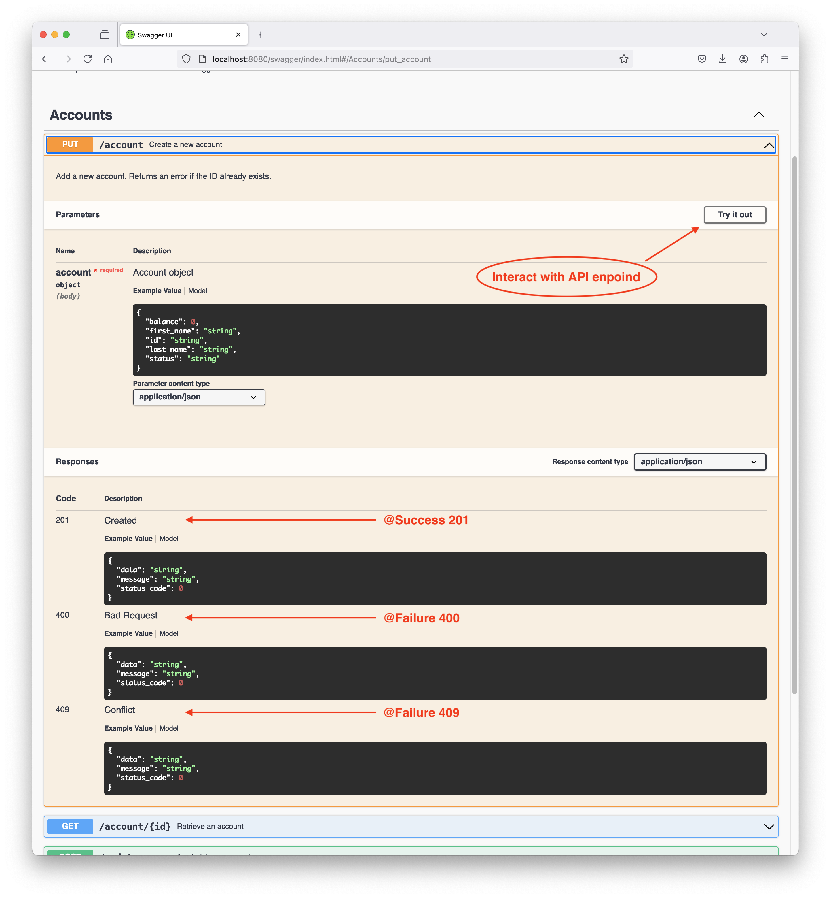

# Swaggo Documentation Example

## About
Swagger is an open-source framework allows automated documentation of APIs. This repository demonstrates how to integrate Swagger documentation into a Go API using Swaggo.

## How to add Swagger to an API in Go (Swaggo)
### 1. Install Swaggo and the required libraries
```bash
go get -u github.com/swaggo/swag/cmd/swag
go get -u github.com/swaggo/http-swagger
```

### 2. Document API endpoints
Example of annotations that can be used. These should be provided in the comments for the endpoint function.
  * `@Summary`
  * `@Descroption`
  * `@Tags`
  * `@Param`
  * `@Success 200`
  * `@Failure 400`
  * `@Router [get]`
  *  Sample use: [GetAccount endpoint](https://github.com/alex-ulnv/swaggo-example/blob/main/api/accounts.go#L12-L22)

### 3. Update main file to serve Swagger UI using docs (that will be generated in the next step).
  * Import HTTP Swagger: [code ref](https://github.com/alex-ulnv/swaggo-example/blob/main/main.go#L11)
  * Import to-be generated docs: [code ref](https://github.com/alex-ulnv/swaggo-example/blob/main/main.go#L8C2-L8C59)
  * Registed Swagger endpoint: [code ref](https://github.com/alex-ulnv/swaggo-example/blob/main/main.go#L27)

### 4. Generate Swagger documentation.
Run the command to build swagger documentation:
```bash
swag init
```
Notes:
* This command scans the comments and creates Swagger template that will be served at Swagger endpoint.
* Therefore, when models or Swagger annotations are modified, this command should be re-ran.
* To remember to run it, it could be helpful to include it as a build task. For example in [Makefile](https://github.com/alex-ulnv/swaggo-example/blob/main/Makefile#L4-L5).

### 5. Run the app and access Swagger UI
The app needs to be started to serve Swagger docs:
```bash
go run main.go
```

Access Swagger docs at the specified endpoint: http://localhost:8080/swagger

## Swagger UI





## Troubleshooting
* Don't see docs updating? - make sure to re-run `swag init` and restart the app
* Swaggo official documentation: https://github.com/swaggo/swag